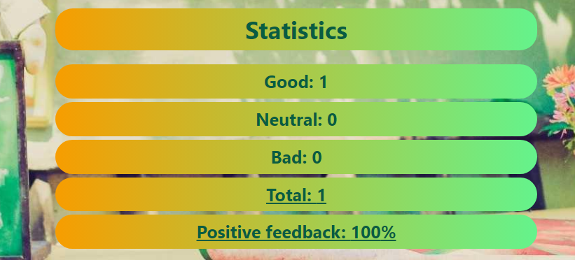

# React Homework - 2 - Feedback widget 

Express Green Cafe collects feedback from its customers. This application was created for the purpose of collecting statistics. There are only three options for feedback: good, neutral and bad. The application includes adding up the total number of reviews and calculating the percentage of good reviews.

## The project used:

`«React»`
`«React Hooks»`
`«Javascript»`
`«Module CSS»`
`«prop-types / npm»`
`«Image Gallery / Lorem Picsum»`

Used assembly: [React project template](https://github.com/goitacademy/react-homework-template#readme)

## Project structure
Feedback block. Which includes a header and three buttons with the option to leave feedback.

Statistics block with 2 states.
`=> If no feedback has been left`

`=> If at least one review is left`
